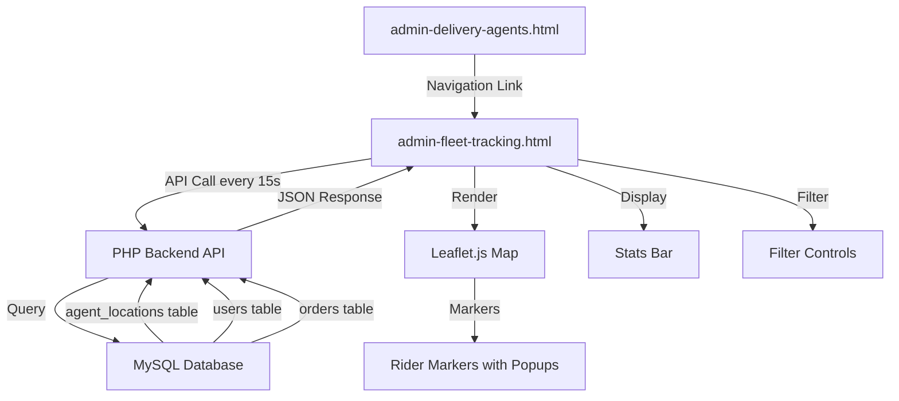
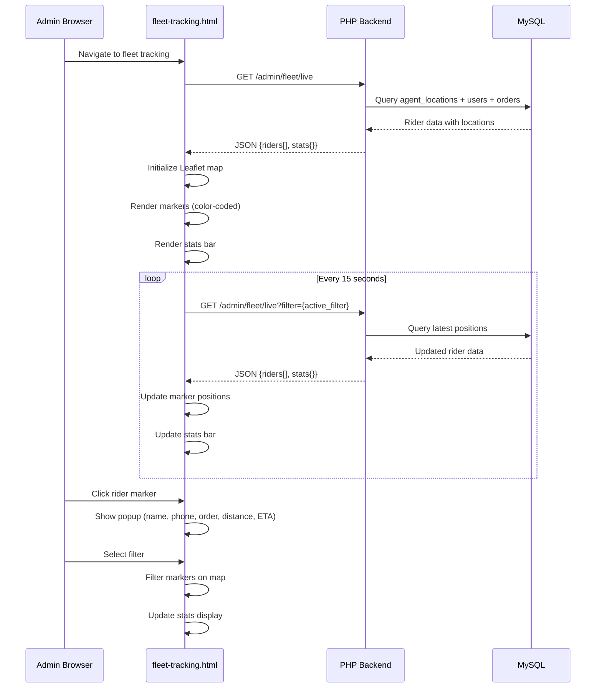
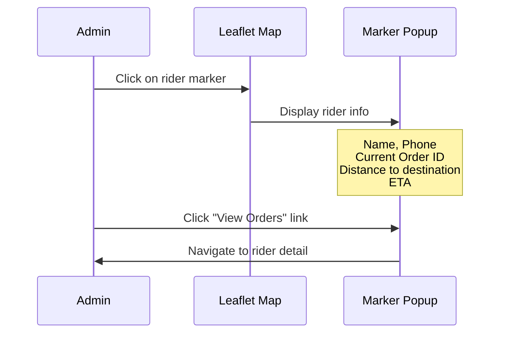

# Design Document: Admin Live Fleet Tracking

## Overview

Admin panel साठी एक real-time fleet tracking map page जो सर्व active delivery partners चे live locations एका interactive Leaflet.js map वर दाखवतो. हा page admin ला fleet visibility देतो — प्रत्येक rider चा status (online/busy/offline), current order info, आणि color-coded markers (Green = idle, Orange = standard delivery, Red = emergency delivery) सह.

System 15-second polling interval वापरून auto-refresh करतो, rider markers वर click केल्यावर detailed popup दाखवतो (name, phone, order ID, distance, ETA), आणि filter options (All/Online/Emergency/Idle) सह stats bar provide करतो. Existing `admin-delivery-agents.html` page वरून या new fleet map ला link असेल.

## Architecture



## Sequence Diagrams

### Main Flow: Page Load & Polling



### Marker Click Detail Flow



## Components and Interfaces

### Component 1: Fleet Tracking Page (Frontend)

**Purpose**: Full-page admin view with Leaflet map, stats bar, and filter controls

**Interface**:
```javascript
// Page State
const FleetTrackingState = {
    map: null,              // Leaflet map instance
    markers: {},            // {agent_id: L.marker} lookup
    allRiders: [],          // Full rider dataset from API
    activeFilter: 'all',   // 'all' | 'online' | 'emergency' | 'idle'
    pollInterval: null,    // setInterval reference (15s)
    statsData: {}          // Aggregated stats
};

// Core Functions
function initMap()                          // Initialize Leaflet with CartoDB tiles
function fetchFleetData(filter)             // GET /admin/fleet/live
function renderMarkers(riders)              // Create/update color-coded markers
function updateStatsBar(stats)              // Update stats display
function applyFilter(filterType)            // Filter visible markers
function createRiderPopup(rider)            // Build popup HTML for marker click
function startPolling()                     // Begin 15s auto-refresh
function stopPolling()                      // Clear interval on page leave
```

**Responsibilities**:
- Initialize and manage Leaflet map instance
- Poll backend every 15 seconds for updated positions
- Render color-coded markers based on rider status
- Handle filter selection and marker visibility
- Display stats bar with real-time counts
- Show detailed popup on marker click

### Component 2: Fleet Live API Endpoint (Backend)

**Purpose**: Aggregate rider locations, statuses, and current order info into a single response

**Interface**:
```php
// AdminController method
public function fleetLive(): JsonResponse
// Route: GET /admin/fleet/live
// Auth: admin role required
// Query params: ?filter=all|online|emergency|idle

// Response Structure
{
    "success": true,
    "data": {
        "riders": [
            {
                "id": 1,
                "name": "Rahul Sharma",
                "phone": "9876543210",
                "status": "active",          // active|busy|offline
                "latitude": 17.9868,
                "longitude": 74.4379,
                "current_order_id": 142,      // null if idle
                "is_emergency": false,
                "destination_lat": 17.9900,
                "destination_lng": 74.4400,
                "distance_to_dest": 2.3,      // km
                "eta_minutes": 12,
                "last_updated": "2024-01-15 14:30:00"
            }
        ],
        "stats": {
            "total": 15,
            "online": 8,
            "in_delivery": 5,
            "idle": 3,
            "emergency_active": 1
        }
    }
}
```

**Responsibilities**:
- Authenticate admin user
- Join agent_locations, users, orders tables
- Calculate distance to destination using Haversine formula
- Estimate ETA based on distance
- Aggregate stats counts
- Support filter parameter for server-side filtering

### Component 3: Stats Bar (UI Component)

**Purpose**: Display real-time fleet statistics at the top of the page

**Interface**:
```javascript
// Stats bar data structure
const StatsConfig = [
    { key: 'total',            label: 'Total Riders',      color: '#1d1d1f' },
    { key: 'online',           label: 'Online',            color: '#34c759' },
    { key: 'in_delivery',      label: 'In Delivery',       color: '#ff9500' },
    { key: 'idle',             label: 'Idle',              color: '#007aff' },
    { key: 'emergency_active', label: 'Emergency Active',  color: '#ff3b30' }
];

function updateStatsBar(stats) // Render stat cards with counts
```

**Responsibilities**:
- Display 5 stat cards in a horizontal grid
- Update counts on each poll cycle
- Color-code values for quick visual scanning

## Data Models

### Rider Fleet Data (API Response)

```javascript
/**
 * @typedef {Object} RiderFleetItem
 * @property {number} id - Agent user ID
 * @property {string} name - Full name
 * @property {string} phone - Contact number
 * @property {'active'|'busy'|'offline'} status - Current duty status
 * @property {number} latitude - Current GPS latitude
 * @property {number} longitude - Current GPS longitude
 * @property {number|null} current_order_id - Active order ID or null
 * @property {boolean} is_emergency - Whether carrying emergency order
 * @property {number|null} destination_lat - Delivery destination latitude
 * @property {number|null} destination_lng - Delivery destination longitude
 * @property {number|null} distance_to_dest - Distance in km
 * @property {number|null} eta_minutes - Estimated time of arrival
 * @property {string} last_updated - Timestamp of last location update
 */

/**
 * @typedef {Object} FleetStats
 * @property {number} total - Total registered riders
 * @property {number} online - Currently online (active + busy)
 * @property {number} in_delivery - Actively delivering
 * @property {number} idle - Online but no active order
 * @property {number} emergency_active - Carrying emergency orders
 */
```

**Validation Rules**:
- `latitude` must be between -90 and 90
- `longitude` must be between -180 and 180
- `status` must be one of: 'active', 'busy', 'offline'
- `last_updated` must be valid datetime string
- `distance_to_dest` is null when rider has no active order

### Database Query (Existing Tables)

```sql
-- Primary query joining existing tables
SELECT 
    u.id,
    u.name,
    u.phone,
    u.status,
    al.latitude,
    al.longitude,
    al.updated_at as last_updated,
    o.id as current_order_id,
    o.is_emergency,
    a.latitude as dest_lat,
    a.longitude as dest_lng
FROM users u
LEFT JOIN agent_locations al ON u.id = al.agent_id
LEFT JOIN orders o ON o.delivery_partner_id = u.id 
    AND o.status IN ('assigned', 'picked_up', 'dispatched')
LEFT JOIN addresses a ON o.address_id = a.id
WHERE u.role = 'delivery' AND u.deleted_at IS NULL
```

## Algorithmic Pseudocode

### Main Processing Algorithm: Fleet Data Aggregation

```javascript
/**
 * ALGORITHM: aggregateFleetData
 * INPUT: filter (string: 'all'|'online'|'emergency'|'idle')
 * OUTPUT: { riders: RiderFleetItem[], stats: FleetStats }
 */
async function aggregateFleetData(filter = 'all') {
    // Step 1: Query all delivery agents with locations and orders
    const rawData = await db.query(FLEET_QUERY);
    
    // Step 2: Compute derived fields for each rider
    const riders = rawData.map(rider => {
        const markerType = determineMarkerType(rider);
        const distance = rider.dest_lat 
            ? haversineDistance(rider.latitude, rider.longitude, rider.dest_lat, rider.dest_lng)
            : null;
        const eta = distance ? Math.ceil(distance / 0.5) : null; // ~30 km/h avg speed
        
        return {
            ...rider,
            marker_type: markerType,    // 'green' | 'orange' | 'red'
            distance_to_dest: distance,
            eta_minutes: eta
        };
    });
    
    // Step 3: Compute stats
    const stats = {
        total: riders.length,
        online: riders.filter(r => r.status !== 'offline').length,
        in_delivery: riders.filter(r => r.current_order_id !== null).length,
        idle: riders.filter(r => r.status === 'active' && !r.current_order_id).length,
        emergency_active: riders.filter(r => r.is_emergency).length
    };
    
    // Step 4: Apply filter
    const filtered = applyRiderFilter(riders, filter);
    
    return { riders: filtered, stats };
}
```

**Preconditions:**
- Database connection is active
- Admin user is authenticated
- `filter` is one of: 'all', 'online', 'emergency', 'idle'

**Postconditions:**
- Returns valid riders array (may be empty)
- Stats reflect full dataset (unfiltered)
- Each rider has computed distance and ETA if destination exists

### Marker Color Determination Algorithm

```javascript
/**
 * ALGORITHM: determineMarkerType
 * INPUT: rider (RiderFleetItem)
 * OUTPUT: 'green' | 'orange' | 'red'
 * 
 * PRECONDITION: rider object has status, current_order_id, is_emergency fields
 * POSTCONDITION: returns exactly one color string
 */
function determineMarkerType(rider) {
    if (rider.is_emergency && rider.current_order_id) {
        return 'red';       // Carrying emergency order
    }
    if (rider.current_order_id) {
        return 'orange';    // Carrying standard order
    }
    return 'green';         // Online/idle or offline
}
```

**Preconditions:**
- `rider` object is non-null
- `rider.is_emergency` is boolean
- `rider.current_order_id` is number or null

**Postconditions:**
- Returns exactly one of: 'green', 'orange', 'red'
- Red takes priority over orange (emergency > standard)
- Green is the default fallback

### Haversine Distance Calculation

```javascript
/**
 * ALGORITHM: haversineDistance
 * INPUT: lat1, lon1, lat2, lon2 (all in degrees)
 * OUTPUT: distance in kilometers (float)
 * 
 * PRECONDITION: all inputs are valid numeric coordinates
 * POSTCONDITION: result >= 0
 */
function haversineDistance(lat1, lon1, lat2, lon2) {
    const R = 6371; // Earth radius in km
    const dLat = toRad(lat2 - lat1);
    const dLon = toRad(lon2 - lon1);
    const a = Math.sin(dLat / 2) ** 2 +
              Math.cos(toRad(lat1)) * Math.cos(toRad(lat2)) *
              Math.sin(dLon / 2) ** 2;
    const c = 2 * Math.atan2(Math.sqrt(a), Math.sqrt(1 - a));
    return R * c;
}

function toRad(deg) { return deg * (Math.PI / 180); }
```

**Preconditions:**
- lat1, lat2 ∈ [-90, 90]
- lon1, lon2 ∈ [-180, 180]

**Postconditions:**
- Result is non-negative float
- Result is in kilometers
- Result = 0 when both points are identical

**Loop Invariants:** N/A (no loops)

### Filter Application Algorithm

```javascript
/**
 * ALGORITHM: applyRiderFilter
 * INPUT: riders (RiderFleetItem[]), filter (string)
 * OUTPUT: filtered subset of riders
 * 
 * PRECONDITION: filter ∈ {'all', 'online', 'emergency', 'idle'}
 * POSTCONDITION: result ⊆ riders
 */
function applyRiderFilter(riders, filter) {
    switch (filter) {
        case 'online':
            return riders.filter(r => r.status === 'active' || r.status === 'busy');
        case 'emergency':
            return riders.filter(r => r.is_emergency && r.current_order_id);
        case 'idle':
            return riders.filter(r => r.status === 'active' && !r.current_order_id);
        case 'all':
        default:
            return riders;
    }
}
```

**Preconditions:**
- `riders` is a valid array
- `filter` is a recognized filter string

**Postconditions:**
- Result is always a subset of input riders
- 'all' filter returns the complete array unchanged
- No mutations to original riders array

## Key Functions with Formal Specifications

### Function 1: initMap()

```javascript
function initMap() {
    const map = L.map('fleet-map', { zoomControl: true }).setView([17.9868, 74.4379], 12);
    L.tileLayer('https://{s}.basemaps.cartocdn.com/rastertiles/voyager/{z}/{x}/{y}.png', {
        attribution: '&copy; CartoDB'
    }).addTo(map);
    return map;
}
```

**Preconditions:**
- DOM element with id 'fleet-map' exists
- Leaflet.js library is loaded
- Network access available for tile loading

**Postconditions:**
- Returns valid Leaflet map instance
- Map is centered on default location (Phaltan area)
- CartoDB Voyager tiles are loaded

### Function 2: renderMarkers(riders)

```javascript
function renderMarkers(riders) {
    // Remove markers for riders no longer in dataset
    Object.keys(state.markers).forEach(id => {
        if (!riders.find(r => r.id == id)) {
            state.map.removeLayer(state.markers[id]);
            delete state.markers[id];
        }
    });
    
    riders.forEach(rider => {
        const icon = createColoredIcon(determineMarkerType(rider));
        
        if (state.markers[rider.id]) {
            // Update existing marker position
            state.markers[rider.id].setLatLng([rider.latitude, rider.longitude]);
            state.markers[rider.id].setIcon(icon);
        } else {
            // Create new marker
            const marker = L.marker([rider.latitude, rider.longitude], { icon })
                .bindPopup(() => createRiderPopup(rider))
                .addTo(state.map);
            state.markers[rider.id] = marker;
        }
    });
}
```

**Preconditions:**
- `state.map` is initialized Leaflet map
- `riders` is array of RiderFleetItem with valid lat/lng
- `state.markers` object exists

**Postconditions:**
- All riders in input have corresponding markers on map
- Stale markers (riders no longer in dataset) are removed
- Marker colors reflect current rider status
- Existing markers are moved (not recreated) for smooth updates

**Loop Invariants:**
- After each iteration, processed rider has exactly one marker on map
- state.markers keys are always valid rider IDs

### Function 3: createRiderPopup(rider)

```javascript
function createRiderPopup(rider) {
    const statusLabel = rider.is_emergency ? 'EMERGENCY' : 
                        rider.current_order_id ? 'In Delivery' : 'Idle';
    const orderInfo = rider.current_order_id 
        ? `<div>Order: #MM-ORD-${rider.current_order_id}</div>
           <div>Distance: ${rider.distance_to_dest?.toFixed(1) || '—'} km</div>
           <div>ETA: ${rider.eta_minutes || '—'} min</div>`
        : '<div>No active order</div>';
    
    return `
        <div class="rider-popup">
            <strong>${rider.name}</strong>
            <div>📞 ${rider.phone || 'N/A'}</div>
            <div class="popup-status ${statusLabel.toLowerCase()}">${statusLabel}</div>
            ${orderInfo}
            <div class="popup-updated">Updated: ${formatTime(rider.last_updated)}</div>
        </div>
    `;
}
```

**Preconditions:**
- `rider` is non-null RiderFleetItem object
- `rider.name` is non-empty string

**Postconditions:**
- Returns valid HTML string
- Popup always shows name and phone
- Order info shown only when current_order_id exists
- Status label reflects emergency > delivery > idle priority

## Example Usage

```javascript
// Example 1: Page initialization
document.addEventListener('DOMContentLoaded', () => {
    state.map = initMap();
    fetchFleetData('all');
    startPolling();
});

// Example 2: Fetch and render fleet data
async function fetchFleetData(filter) {
    try {
        const res = await api.get(`/admin/fleet/live?filter=${filter}`);
        const { riders, stats } = res.data;
        state.allRiders = riders;
        renderMarkers(riders);
        updateStatsBar(stats);
    } catch (err) {
        console.error('Fleet data fetch failed:', err);
    }
}

// Example 3: Filter change handler
function applyFilter(filterType) {
    state.activeFilter = filterType;
    // Highlight active filter button
    document.querySelectorAll('.filter-btn').forEach(btn => btn.classList.remove('active'));
    document.querySelector(`[data-filter="${filterType}"]`).classList.add('active');
    // Re-fetch with filter
    fetchFleetData(filterType);
}

// Example 4: Start/stop polling
function startPolling() {
    state.pollInterval = setInterval(() => {
        fetchFleetData(state.activeFilter);
    }, 15000);
}

function stopPolling() {
    if (state.pollInterval) {
        clearInterval(state.pollInterval);
        state.pollInterval = null;
    }
}

// Example 5: Color-coded marker icon creation
function createColoredIcon(type) {
    const colors = { green: '#34c759', orange: '#ff9500', red: '#ff3b30' };
    const icons = { green: 'circle-dot', orange: 'truck', red: 'alert-triangle' };
    
    return L.divIcon({
        className: `rider-marker-${type}`,
        html: `<div style="background:${colors[type]}; color:white; padding:10px; border-radius:50%; box-shadow:0 0 15px ${colors[type]}40;">
                 <i data-lucide="${icons[type]}" style="width:18px; height:18px;"></i>
               </div>`,
        iconSize: [38, 38],
        iconAnchor: [19, 19]
    });
}
```

## Correctness Properties

### Property 1: Red Marker Implies Emergency Order

∀ rider ∈ riders: marker_color(rider) = red ⟹ rider.is_emergency ∧ rider.current_order_id ≠ null

A red marker is shown if and only if the rider is carrying an emergency order.

### Property 2: Orange Marker Implies Standard Delivery

∀ rider ∈ riders: marker_color(rider) = orange ⟹ rider.current_order_id ≠ null ∧ ¬rider.is_emergency

An orange marker is shown if and only if the rider has a standard (non-emergency) active order.

### Property 3: Green Marker Implies Idle

∀ rider ∈ riders: marker_color(rider) = green ⟹ rider.current_order_id = null

A green marker is shown if and only if the rider has no active order.

### Property 4: Stats Reflect Full Dataset

stats.total = |riders_unfiltered|

Stats always reflect the full dataset regardless of active filter.

### Property 5: Online Count Consistency

stats.online = count(riders where status ≠ 'offline')

Online count equals the number of all non-offline riders.

### Property 6: Filter Subset Guarantee

∀ filter ∈ {all, online, emergency, idle}: applyFilter(riders, filter) ⊆ riders

Filtering never introduces riders not in the original dataset.

### Property 7: Polling Lifecycle

polling_interval = 15000ms ∧ polling stops on page unload

Auto-refresh runs exactly every 15 seconds and is cleaned up properly.

### Property 8: Distance Non-Negativity

haversineDistance(p, p) = 0 ∧ ∀ a, b: haversineDistance(a, b) ≥ 0

Distance to self is zero; distance is always non-negative.

## Error Handling

### Error Scenario 1: API Fetch Failure

**Condition**: Network error or server 500 during polling
**Response**: Log error to console, retain last known marker positions on map, show subtle toast notification
**Recovery**: Next poll cycle (15s) will retry automatically; no user action needed

### Error Scenario 2: Rider with No Location Data

**Condition**: Rider exists in users table but has no entry in agent_locations
**Response**: Exclude rider from map markers, still count in stats as offline
**Recovery**: Rider appears on map once they update their location via the delivery app

### Error Scenario 3: Stale Location Data

**Condition**: Rider's `last_updated` is older than 5 minutes
**Response**: Show marker with reduced opacity (0.5) and "Last seen X min ago" in popup
**Recovery**: Marker returns to full opacity when fresh data arrives

### Error Scenario 4: Authentication Failure

**Condition**: Admin token expired or invalid
**Response**: Stop polling, redirect to login page
**Recovery**: User re-authenticates and returns to fleet tracking page

## Testing Strategy

### Unit Testing Approach

- Test `determineMarkerType()` with all status/order combinations
- Test `haversineDistance()` with known coordinate pairs
- Test `applyRiderFilter()` with each filter type
- Test `createRiderPopup()` HTML output for various rider states
- Test stats aggregation logic with mock rider arrays

### Property-Based Testing Approach

**Property Test Library**: Manual assertion-based tests (vanilla JS project)

- For any rider array, filtered result is always a subset
- Marker color is deterministic: same input always produces same color
- Distance calculation is symmetric: dist(A,B) = dist(B,A)
- Stats total always equals unfiltered rider count

### Integration Testing Approach

- Test full API endpoint `/admin/fleet/live` with seeded database
- Verify response structure matches expected schema
- Test filter parameter produces correct subsets
- Test with 0 riders, 1 rider, and many riders
- Verify admin auth guard rejects non-admin users

## Performance Considerations

- **Polling vs WebSocket**: 15-second polling chosen for simplicity with PHP backend (no persistent connections needed). Acceptable for admin monitoring use case.
- **Marker Management**: Reuse existing Leaflet markers (setLatLng) instead of removing/recreating on each poll to avoid DOM thrashing.
- **Database Query**: Single JOIN query fetches all needed data in one round-trip. Index on `agent_locations.agent_id` and `orders.delivery_partner_id` ensures fast lookups.
- **Map Bounds**: Auto-fit map bounds to show all visible markers, with padding for readability.
- **Payload Size**: With typical fleet of 10-50 riders, response payload is <10KB per poll — negligible bandwidth.

## Security Considerations

- **Authentication**: Admin role check via AuthGuard + RoleCheck middleware on backend endpoint
- **Authorization**: Only users with `role = 'admin'` can access fleet tracking data
- **Data Exposure**: Phone numbers shown in popup — acceptable for admin panel, but not exposed to public
- **Rate Limiting**: 15-second poll interval is reasonable; backend should still enforce rate limits
- **Input Validation**: Filter parameter validated server-side against allowed values

## Dependencies

- **Leaflet.js v1.9.4** — Map rendering (already used in order-tracking-map.html)
- **CartoDB Voyager Tiles** — Map tile provider (already configured)
- **Lucide Icons** — UI icons (already used across admin panel)
- **Plus Jakarta Sans** — Typography (already loaded)
- **api.js** — Existing API helper for authenticated requests
- **auth.js** — Existing auth utility for role checking
- **components.js** — Existing UI components (sidebar, loader, etc.)
- **liquid.css** — Existing design system styles
- **admin-dark.css** — Existing admin theme styles
