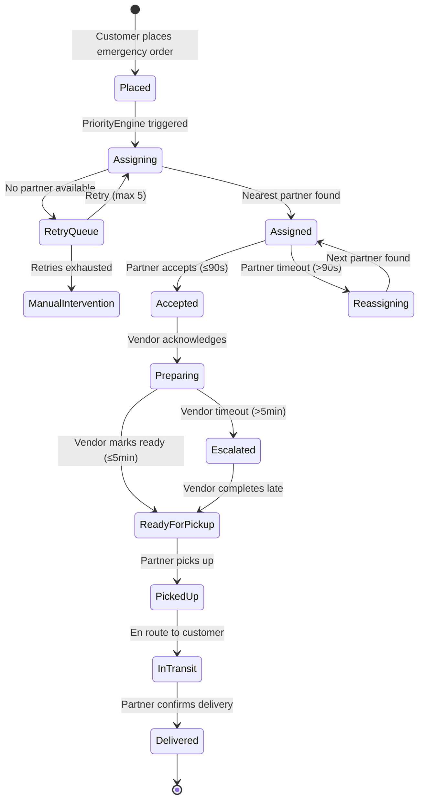

# Design Document: Emergency Order Priority System

## Overview

This design implements a comprehensive priority pipeline for emergency medicine orders across the existing PHP/MySQL XAMPP stack. The system introduces a `PriorityEngine` service that orchestrates emergency order handling through four stages: auto-assignment with nearest-rider selection, vendor preparation with enforced deadlines, delivery partner priority queuing, and customer-facing ETA tracking.

The architecture leverages the existing polling-based frontend (no WebSockets), the `NotificationService` for alerts, the `SLATracker` for deadline monitoring, and the `DeliveryRouterService` for distance calculations. A new cron-triggered monitoring endpoint handles SLA evaluation every 60 seconds.

### Key Design Decisions

1. **Polling over WebSockets**: All real-time updates use frontend polling (30s for admin/customer, 10s for vendor/delivery) via the existing `api.js` infrastructure.
2. **Haversine distance calculation**: Straight-line geographic distance computed server-side in PHP using the Haversine formula, replacing the simulated `findNearestAgent()` in `DeliveryRouterService`.
3. **Cron-based SLA monitoring**: A dedicated PHP endpoint (`/api/cron/emergency-sla-check`) invoked by XAMPP's scheduled task or a browser-based cron tab every 60 seconds.
4. **Audio via Web Audio API**: Emergency alert sounds generated client-side using the Web Audio API (no external audio files needed), with fallback to visual overlay.
5. **Database-driven state**: All priority state (SLA deadlines, assignment metadata, escalation logs) stored in MySQL, making the system stateless between requests.

## Architecture

```mermaid
graph TB
    subgraph Frontend ["Frontend (Polling)"]
        AP[Admin Panel<br/>30s poll]
        VP[Vendor Panel<br/>10s poll]
        DP[Delivery Panel<br/>10s poll]
        CP[Customer Panel<br/>30s poll]
    end

    subgraph Backend ["Backend (PHP)"]
        PE[PriorityEngine<br/>Service]
        OC[OrderController]
        DC[DeliveryController]
        AC[AdminController]
        NS[NotificationService]
        SLA[SLATracker]
        DRS[DeliveryRouterService]
    end

    subgraph Database ["MySQL"]
        OT[orders table<br/>+ sla_deadline<br/>+ emergency_locked]
        EAL[emergency_assignment_log]
        ESC[emergency_escalations]
        OSL[order_status_logs]
    end

    subgraph Cron ["Scheduled Tasks"]
        CRON[SLA Monitor Cron<br/>Every 60s]
    end

    AP -->|GET /admin/emergency-orders| AC
    VP -->|GET /vendor/emergency-orders| OC
    DP -->|GET /delivery/priority-queue| DC
    CP -->|GET /orders/{id}/emergency-tracking| OC

    AC --> PE
    OC --> PE
    DC --> PE
    PE --> NS
    PE --> SLA
    PE --> DRS
    PE --> OT
    PE --> EAL
    PE --> ESC
    CRON -->|POST /cron/emergency-sla-check| PE
```

## Components and Interfaces

### 1. PriorityEngine Service (`backend/app/Services/PriorityEngine.php`)

The central orchestrator for all emergency order logic.

```php
<?php
namespace App\Services;

class PriorityEngine {
    // Core assignment methods
    public function processEmergencyAssignment(int $orderId): array;
    public function findNearestEligiblePartner(float $vendorLat, float $vendorLng, int $excludePartnerId = 0): ?array;
    public function calculateHaversineDistance(float $lat1, float $lng1, float $lat2, float $lng2): float;
    public function lockPartner(int $partnerId, int $orderId): bool;
    public function unlockPartner(int $partnerId): bool;
    
    // SLA monitoring methods
    public function evaluateActiveSLAs(): array;
    public function triggerEscalation(int $orderId, string $reason, string $level): bool;
    public function attemptReassignment(int $orderId, string $reason): bool;
    
    // Retry queue methods
    public function addToRetryQueue(int $orderId): bool;
    public function processRetryQueue(): array;
    
    // Status helpers
    public function getEmergencyOrderStatus(int $orderId): array;
    public function calculateETA(int $orderId): ?int; // minutes
    public function getSLAProgress(int $orderId): array;
}
```

### 2. Modified DeliveryRouterService (`backend/app/Services/DeliveryRouterService.php`)

Enhanced with real Haversine calculation and partner eligibility filtering.

```php
// New methods added to existing service
public function findNearestEligiblePartners(float $lat, float $lng, int $limit = 5, int $excludeId = 0): array;
public function haversineDistance(float $lat1, float $lng1, float $lat2, float $lng2): float;
public function getOnlinePartnersInRadius(float $lat, float $lng, float $radiusKm = 5.0): array;
```

### 3. Modified OrderController (`backend/app/Controllers/OrderController.php`)

New endpoints for emergency order operations.

```php
// New methods
public function emergencyTracking();      // GET /orders/{id}/emergency-tracking
public function vendorEmergencyOrders();  // GET /vendor/emergency-orders
public function acknowledgeEmergency();   // POST /orders/{id}/acknowledge-emergency
public function markReadyForPickup();     // POST /orders/{id}/ready-for-pickup
```

### 4. Modified AdminController (`backend/app/Controllers/AdminController.php`)

New endpoint for emergency order monitoring.

```php
// New methods
public function emergencyOrders();        // GET /admin/emergency-orders
public function manualReassign();         // POST /admin/emergency-orders/{id}/reassign
public function emergencySlaCheck();      // POST /cron/emergency-sla-check
```

### 5. Modified DeliveryController (`backend/app/Controllers/DeliveryController.php`)

New endpoints for delivery partner priority queue.

```php
// New methods
public function priorityQueue();          // GET /delivery/priority-queue
public function acceptEmergency();        // POST /delivery/emergency/{id}/accept
public function pickupEmergency();        // POST /delivery/emergency/{id}/pickup
public function deliverEmergency();       // POST /delivery/emergency/{id}/deliver
```

### 6. Frontend Emergency Module (`frontend/assets/js/emergency-alerts.js`)

Shared JavaScript module for audio/visual alerts across all panels.

```javascript
const EmergencyAlerts = {
    // Audio alert system
    playEmergencyTone(options = {}): void;
    stopAudio(): void;
    startRepeatingAlert(intervalMs = 10000): void;
    
    // Visual alert system
    showFullScreenOverlay(orderData): void;
    hideOverlay(): void;
    applyPulseAnimation(element, pulsesPerSecond = 1): void;
    
    // Polling manager
    startPolling(endpoint, intervalMs, callback): number;
    stopPolling(pollId): void;
    
    // SLA countdown display
    formatCountdown(remainingSeconds): string;
    formatElapsedBreach(elapsedSeconds): string;
    calculateSLAProgress(createdAt, slaMinutes = 40): number;
};
```

### API Endpoints (New Routes)

| Method | Endpoint | Controller | Description |
|--------|----------|------------|-------------|
| GET | `/admin/emergency-orders` | AdminController@emergencyOrders | List active emergency orders with SLA status |
| POST | `/admin/emergency-orders/{id}/reassign` | AdminController@manualReassign | Manual rider reassignment |
| POST | `/cron/emergency-sla-check` | AdminController@emergencySlaCheck | Cron-triggered SLA evaluation |
| GET | `/vendor/emergency-orders` | OrderController@vendorEmergencyOrders | Vendor's emergency orders with deadlines |
| POST | `/orders/{id}/acknowledge-emergency` | OrderController@acknowledgeEmergency | Vendor acknowledges emergency order |
| POST | `/orders/{id}/ready-for-pickup` | OrderController@markReadyForPickup | Vendor marks order ready |
| GET | `/delivery/priority-queue` | DeliveryController@priorityQueue | Priority-sorted delivery queue |
| POST | `/delivery/emergency/{id}/accept` | DeliveryController@acceptEmergency | Partner accepts emergency order |
| POST | `/delivery/emergency/{id}/pickup` | DeliveryController@pickupEmergency | Partner confirms pickup |
| POST | `/delivery/emergency/{id}/deliver` | DeliveryController@deliverEmergency | Partner confirms delivery |
| GET | `/orders/{id}/emergency-tracking` | OrderController@emergencyTracking | Customer ETA and stage tracking |

## Data Models

### Database Schema Changes

#### 1. Alter `orders` table

```sql
ALTER TABLE orders
    ADD COLUMN sla_deadline DATETIME NULL AFTER is_emergency,
    ADD COLUMN emergency_locked TINYINT(1) DEFAULT 0 AFTER sla_deadline,
    ADD COLUMN sla_breach TINYINT(1) DEFAULT 0 AFTER emergency_locked,
    ADD COLUMN emergency_acknowledged_at DATETIME NULL,
    ADD COLUMN emergency_ready_at DATETIME NULL,
    ADD COLUMN emergency_picked_up_at DATETIME NULL,
    ADD COLUMN emergency_delivered_at DATETIME NULL,
    ADD COLUMN assignment_retry_count INT DEFAULT 0,
    ADD COLUMN reassignment_count INT DEFAULT 0,
    ADD INDEX idx_emergency_active (is_emergency, status, sla_deadline),
    ADD INDEX idx_emergency_partner (delivery_partner_id, emergency_locked);
```

#### 2. New `emergency_assignment_log` table

```sql
CREATE TABLE emergency_assignment_log (
    id INT AUTO_INCREMENT PRIMARY KEY,
    order_id INT NOT NULL,
    partner_id INT NOT NULL,
    assignment_timestamp DATETIME NOT NULL,
    rider_distance_km DECIMAL(6,2) NOT NULL,
    sla_deadline DATETIME NOT NULL,
    vendor_lat DECIMAL(10,7),
    vendor_lng DECIMAL(10,7),
    partner_lat DECIMAL(10,7),
    partner_lng DECIMAL(10,7),
    assignment_type ENUM('initial', 'reassignment', 'retry') DEFAULT 'initial',
    status ENUM('assigned', 'accepted', 'timeout', 'revoked') DEFAULT 'assigned',
    accepted_at DATETIME NULL,
    revoked_at DATETIME NULL,
    revoke_reason VARCHAR(255) NULL,
    created_at DATETIME DEFAULT CURRENT_TIMESTAMP,
    INDEX idx_order (order_id),
    INDEX idx_partner (partner_id),
    INDEX idx_status (status),
    FOREIGN KEY (order_id) REFERENCES orders(id),
    FOREIGN KEY (partner_id) REFERENCES users(id)
);
```

#### 3. New `emergency_escalations` table

```sql
CREATE TABLE emergency_escalations (
    id INT AUTO_INCREMENT PRIMARY KEY,
    order_id INT NOT NULL,
    escalation_level ENUM('warning', 'critical', 'breach', 'manual_intervention') NOT NULL,
    reason VARCHAR(500) NOT NULL,
    triggered_at DATETIME NOT NULL,
    resolved_at DATETIME NULL,
    resolved_by INT NULL,
    partner_id INT NULL,
    vendor_id INT NULL,
    remaining_minutes DECIMAL(5,1) NULL,
    action_taken VARCHAR(255) NULL,
    created_at DATETIME DEFAULT CURRENT_TIMESTAMP,
    INDEX idx_order (order_id),
    INDEX idx_level (escalation_level),
    INDEX idx_unresolved (resolved_at),
    FOREIGN KEY (order_id) REFERENCES orders(id)
);
```

#### 4. New `emergency_retry_queue` table

```sql
CREATE TABLE emergency_retry_queue (
    id INT AUTO_INCREMENT PRIMARY KEY,
    order_id INT NOT NULL UNIQUE,
    attempt_count INT DEFAULT 0,
    max_attempts INT DEFAULT 5,
    last_attempt_at DATETIME NULL,
    next_attempt_at DATETIME NULL,
    status ENUM('pending', 'assigned', 'exhausted') DEFAULT 'pending',
    created_at DATETIME DEFAULT CURRENT_TIMESTAMP,
    INDEX idx_pending (status, next_attempt_at),
    FOREIGN KEY (order_id) REFERENCES orders(id)
);
```

#### 5. Alter `users` table (delivery partners)

```sql
ALTER TABLE users
    ADD COLUMN emergency_locked_order_id INT NULL,
    ADD COLUMN last_idle_since DATETIME NULL,
    ADD COLUMN is_non_responsive TINYINT(1) DEFAULT 0,
    ADD INDEX idx_delivery_available (role, is_online, emergency_locked_order_id);
```

### Data Flow: Emergency Order Lifecycle



## Correctness Properties

*A property is a characteristic or behavior that should hold true across all valid executions of a system — essentially, a formal statement about what the system should do. Properties serve as the bridge between human-readable specifications and machine-verifiable correctness guarantees.*

### Property 1: Emergency Orders Always Precede Standard Orders in Priority Processing

*For any* mixed collection of emergency and standard orders passed to the priority sorting function, all emergency orders SHALL appear before all standard orders in the output, regardless of creation time or other attributes.

**Validates: Requirements 1.1, 4.1**

### Property 2: Nearest Eligible Partner Selection

*For any* set of delivery partners with known GPS coordinates and a given vendor location, the assignment algorithm SHALL select the partner with the minimum Haversine distance who is online, within shift hours, and has no active emergency lock. If two partners have equal distance (within 0.01km tolerance), the partner with the earlier `last_idle_since` timestamp SHALL be selected.

**Validates: Requirements 1.2**

### Property 3: SLA Deadline Calculation

*For any* emergency order with a `created_at` timestamp, the computed `sla_deadline` SHALL equal `created_at + 40 minutes` exactly, regardless of the time of day, timezone, or other order attributes.

**Validates: Requirements 1.3**

### Property 4: Partner Exclusivity During Emergency Assignment

*For any* delivery partner who is locked to an active emergency order, the partner selection algorithm SHALL never return that partner as a candidate for any other order (emergency or standard) until the lock is released upon delivery confirmation.

**Validates: Requirements 1.4, 4.5**

### Property 5: Fallback Assignment Beyond Radius

*For any* emergency order where no eligible partner exists within 5km of the vendor, the algorithm SHALL still assign the nearest eligible partner regardless of distance, and the assignment log SHALL contain a warning entry indicating the distance exceeded the preferred radius.

**Validates: Requirements 1.5**

### Property 6: Assignment Metadata Completeness

*For any* emergency order assignment event, the resulting `emergency_assignment_log` record SHALL contain non-null values for: `assignment_timestamp`, `rider_distance_km`, and `sla_deadline`.

**Validates: Requirements 1.6**

### Property 7: Timeout-Based Reassignment to Next Nearest

*For any* emergency order where the assigned partner has not accepted within the timeout period, the system SHALL revoke the assignment and select the next nearest eligible partner (excluding the timed-out partner). The total reassignment count SHALL never exceed the configured maximum (3 for delivery acceptance, 2 for SLA-risk reassignment).

**Validates: Requirements 1.8, 4.4**

### Property 8: SLA Status Classification

*For any* active emergency order, given the current time and the order's `sla_deadline`: if `remaining_time < 0`, the status SHALL be "breached" with elapsed breach time formatted as MM:SS; if `0 ≤ remaining_time < 10 minutes`, the status SHALL be "warning"; otherwise the status SHALL be "normal". These classifications are mutually exclusive and exhaustive.

**Validates: Requirements 2.3, 2.4**

### Property 9: Emergency Order Sort Order

*For any* set of active emergency orders displayed in the admin panel, breached orders SHALL appear before non-breached orders. Within breached orders, sorting SHALL be by elapsed breach time descending. Within non-breached orders, sorting SHALL be by remaining SLA time ascending.

**Validates: Requirements 2.6**

### Property 10: Vendor Escalation on Deadline Expiry

*For any* emergency order, if the `Preparation_Deadline` (5 minutes from alert delivery) expires and the order has NOT been acknowledged (vendor selection recorded) OR has been acknowledged but NOT marked "ready for pickup", the system SHALL create an escalation record. If the order IS acknowledged before the deadline, no escalation SHALL be triggered for the acknowledgment condition.

**Validates: Requirements 3.3, 3.7, 3.8**

### Property 11: ETA Calculation Correctness

*For any* two GPS coordinate pairs (rider position, destination position), the calculated ETA in minutes SHALL equal `(haversine_distance_km / average_speed_kmh) * 60 + buffer_minutes`, where the result is always a positive number and the Haversine distance is mathematically correct (satisfies triangle inequality, is symmetric, and equals zero only when positions are identical).

**Validates: Requirements 5.3**

### Property 12: SLA Progress Percentage

*For any* emergency order with a known `created_at` timestamp and a 40-minute SLA window, the progress percentage SHALL equal `min(100, (elapsed_seconds / 2400) * 100)`, always yielding a value between 0 and 100 inclusive.

**Validates: Requirements 5.5**

### Property 13: Delay Detection

*For any* active emergency order where the calculated ETA (current time + estimated remaining delivery time) exceeds the `sla_deadline`, the system SHALL flag the order as "at risk of breach". If the ETA does NOT exceed the deadline, no delay flag SHALL be set.

**Validates: Requirements 5.6**

### Property 14: SLA Monitoring Escalation Tiers

*For any* active emergency order evaluated by the SLA monitor: if remaining time < 15 minutes AND status is not "picked_up" or "in_transit" or "delivered", a warning-level escalation SHALL be triggered. If remaining time < 10 minutes AND status is not "picked_up" or "in_transit" or "delivered", an automatic reassignment SHALL be attempted (max 2 attempts). These tiers are cumulative (the 10-minute check also satisfies the 15-minute condition).

**Validates: Requirements 6.2, 6.3**

### Property 15: Breach Audit Logging Completeness

*For any* emergency order that breaches its SLA deadline, the audit log entry SHALL contain: `order_id`, `partner_id` (or null if unassigned), `elapsed_time` (seconds beyond deadline), and `reason` (non-empty string). No breach SHALL go unlogged.

**Validates: Requirements 6.4**

### Property 16: Three-Party Notification on Reassignment

*For any* SLA-risk reassignment event, exactly three notifications SHALL be created: one for the original delivery partner, one for the new delivery partner, and one for the admin. Each notification SHALL reference the order ID and the reassignment reason.

**Validates: Requirements 6.5**

### Property 17: Accept Records Timestamp and Transitions Status

*For any* emergency order acceptance by a delivery partner, the system SHALL record a non-null `accepted_at` timestamp in the assignment log AND transition the order status to "accepted". The timestamp SHALL be within 1 second of the server's current time at the moment of acceptance.

**Validates: Requirements 4.7**

## Error Handling

### Backend Error Scenarios

| Scenario | Handling | Recovery |
|----------|----------|----------|
| No delivery partners online | Add to retry queue, notify admin | Retry every 60s, max 5 attempts |
| Partner GPS data stale (>5 min) | Exclude from assignment candidates | Partner must update location to re-enter pool |
| Database connection failure during assignment | Log error, return 503 | Frontend retries on next poll cycle |
| Concurrent assignment race condition | Use `SELECT ... FOR UPDATE` row locking | Second request gets next available partner |
| Haversine calculation with invalid coordinates | Validate lat/lng ranges before calculation | Return error, skip partner |
| SLA cron overlapping execution | Check lock file/flag before processing | Skip if previous run still active |
| Vendor panel offline during alert | Notification stored in DB | Vendor sees alert on next poll |
| Audio playback blocked by browser | Detect via Web Audio API promise rejection | Show full-screen visual overlay |

### HTTP Error Responses

```php
// Standard error format used across all new endpoints
{
    "success": false,
    "error": "Human-readable error message",
    "code": "EMERGENCY_NO_PARTNER_AVAILABLE",
    "data": { /* contextual details */ }
}
```

### Error Codes

| Code | HTTP Status | Description |
|------|-------------|-------------|
| `EMERGENCY_NO_PARTNER_AVAILABLE` | 503 | No eligible delivery partner found |
| `EMERGENCY_ORDER_NOT_FOUND` | 404 | Order ID invalid or not emergency type |
| `EMERGENCY_ALREADY_ASSIGNED` | 409 | Order already has an active assignment |
| `EMERGENCY_PARTNER_LOCKED` | 409 | Partner already locked to another emergency |
| `EMERGENCY_MAX_RETRIES_EXCEEDED` | 422 | Retry queue exhausted for this order |
| `EMERGENCY_REASSIGNMENT_LIMIT` | 422 | Maximum reassignment attempts reached |
| `EMERGENCY_SLA_BREACHED` | 200 | Order delivered but SLA was breached (info) |
| `EMERGENCY_UNAUTHORIZED` | 403 | User lacks permission for this action |

## Testing Strategy

### Property-Based Testing

This feature is well-suited for property-based testing because the core logic involves:
- Pure algorithmic functions (distance calculation, sorting, deadline computation)
- State machine transitions with clear invariants
- Input-dependent behavior across large input spaces (GPS coordinates, time values, partner sets)

**Library**: [PHPUnit](https://phpunit.de/) with [Eris](https://github.com/giorgiosironi/eris) (property-based testing for PHP)

**Configuration**: Each property test runs a minimum of 100 iterations.

**Tag format**: `Feature: emergency-order-priority-system, Property {number}: {property_text}`

### Unit Tests (Example-Based)

| Test Area | Examples |
|-----------|----------|
| Assignment with no partners in radius | Verify fallback to nearest regardless of distance |
| Retry queue max attempts | Verify queue stops after 5 attempts |
| Vendor acknowledgment stops escalation | Verify escalation timer cancelled |
| Audio fallback to visual overlay | Verify overlay shown when audio blocked |
| Admin sort with mixed breach states | Verify correct ordering |
| ETA with stale GPS data | Verify stale label applied |
| Concurrent acceptance race | Verify only first acceptance succeeds |

### Integration Tests

| Test Area | Approach |
|-----------|----------|
| Full order lifecycle | Place emergency order → assign → accept → pickup → deliver |
| SLA cron execution | Trigger cron endpoint, verify escalations created |
| Notification delivery | Verify notifications created for all parties |
| Polling endpoint responses | Verify correct JSON structure and data freshness |
| Database constraint enforcement | Verify foreign keys and unique constraints |

### Frontend Tests

| Test Area | Approach |
|-----------|----------|
| Countdown timer accuracy | Manual verification of 1-second updates |
| Audio alert playback | Manual test across Chrome, Firefox, Edge |
| Polling interval correctness | Browser DevTools network tab verification |
| Visual indicators (pulse, red border) | Visual regression via screenshots |
| Full-screen overlay fallback | Block audio permission, verify overlay appears |

### Test Environment

- PHPUnit 9.x for backend unit and property tests
- Eris library for property-based test generation
- MySQL test database (separate from development)
- Browser-based manual testing for frontend audio/visual features
- XAMPP cron simulation via browser tab for SLA monitoring tests
